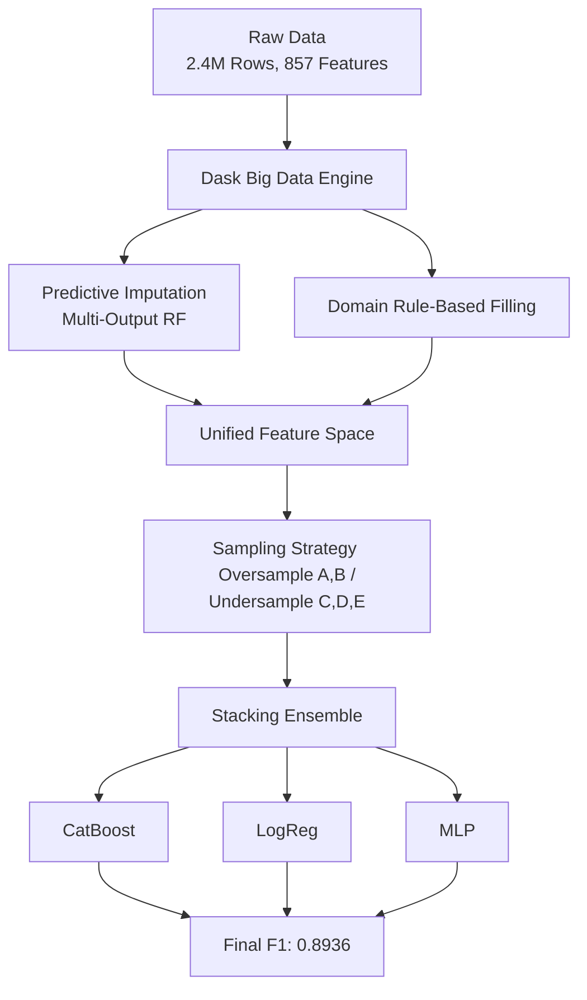

# 💳 Credit Card Customer Segment Classification: High-Dimensional Big Data Pipeline

[](https://www.python.org/downloads/)
[](https://catboost.ai/)
[]()

## 🎯 Executive Summary
In the hyper-competitive financial sector, understanding customer behavior through precise segmentation is the key to maximizing marketing ROI and minimizing churn. This project delivers a high-performance classification pipeline to segment **2.4 million credit card customers** using a high-dimensional dataset of **857 features**.

- **The Problem**: Segmenting 2.4M credit card customers with 857 features, suffering from extreme class imbalance (minority class < 0.01%) and complex missing patterns.
- **The Solution**: Built a robust pipeline using **Dask** for big data scale, predictive ML imputation for missing data, and a **Stacking Ensemble** (CatBoost + LogReg + MLP).
- **The Result**: Achieved **Top 25% (58th Place)** in the competition with a validation F1-score of **0.8936**.

## 🛠 Tech Stack
- **Big Data Scale**: Dask (Handling 2.4M rows efficiently)
- **Modeling**: CatBoost, Stacking Ensemble (CatBoost + LogReg + MLP)
- **Pre-processing**: Multi-Output Random Forest Imputation
- **Data Processing**: Pandas, NumPy

---

## 🔬 1. Problem Definition
In the hyper-competitive financial sector, understanding customer behavior through precise segmentation is the key to maximizing marketing ROI and minimizing churn.
- **The Challenge**: Segmenting 2.4 million credit card customers using a high-dimensional dataset of 857 features.
- **The Complications**: Extreme class imbalance (minority class B has only 144 samples out of 2.4M) and complex missing patterns across hundreds of variables.
- **Objective**: To build a high-performance classification pipeline that accurately classifies customers into 5 segments while handling big data scale and missing values.

---

## 🛠️ 2. System Architecture
To handle the scale and complexity of the dataset, we developed a distributed pipeline using Dask and a stacked model architecture. This ensures that the massive data can be processed on a single machine efficiently.



---

## 📊 3. Data Challenges & Preprocessing
The primary challenge in this project was not the modeling, but the data itself. We faced extreme volume and imbalance.
- **Volume**: 2,400,000 rows × 857 columns.
- **Extreme Imbalance**: 
  - Class E (Majority): ~1.9M
  - Class B (Extreme Minority): 144
  - *Strategy*: Oversampling minority classes (A, B) and controlled undersampling of majority classes (C, D, E) to train a balanced model.

### 🧠 Advanced Missing Data Handling
Instead of applying blind automation, this project implements a **domain-driven and predictive preprocessing pipeline** based on a rigorous analysis of missing mechanisms.
- **Missing Mechanism Analysis**: Conducted Chi-Square tests to classify missingness. Discovered that missingness in key variables was significantly related to the target (`Segment`), proving that the 'fact of missingness' itself carried predictive information.
- **Predictive Imputation**: For features with high missing rates like Benefit Usage Rate, trained a **Multi-Output RandomForest Regressor** on non-missing data to predict missing values based on customer age, gender, and current usage amounts.
- **Conditional Imputation**: For usage-related variables, filled with 'Unused' (미사용) if the corresponding usage amount was 0, and 'Unknown' otherwise, preserving domain logic.
- **Missingness as a Feature**: Created binary flags for missing patterns. The fact that a variable is missing is often a strong behavioral signal in credit data.

---

## 🤖 4. Modeling & Results
We benchmarked state-of-the-art tabular models to find the optimal balance between training speed and predictive power.

| Model | Strategy | F1-Score | Key Insight |
| :--- | :--- | :---: | :--- |
| **XGBoost** | Baseline | 0.607 | Fast but struggled with extreme imbalance. |
| **CatBoost** | Full Feature Set | **0.8893 (Val)** | Best single model. Handled categorical features natively. |
| **TabNet** | Deep Learning | 0.8285 | Captured complex non-linearities but slower than trees. |
| **Stacking Ensemble** | CatBoost + LogReg + MLP | **0.8936 (Val)** | **Final Choice**. Combined the best of both worlds. |


*Figure: Comparison of Weighted F1-Scores across different models.*

### ⚠️ Limitations & Future Work
- **Overfitting Risk**: Oversampling Class B by a large margin carries a high risk of overfitting to specific customer profiles.
- **SHAP (Explainable AI)**: Future work includes implementing SHAP to explain *why* a customer is classified into a specific segment, providing actionable insights for the marketing team.

---

## 🏁 5. Conclusion & Business Impact
The project successfully demonstrated how to handle high-dimensional big data with extreme imbalance.
- **Outcome**: Achieved **Top 25% (58th Place)** in the competition with a validation F1-score of **0.8936**.
- **Impact**: The advanced missing data handling techniques proved that missingness can be information, not just noise. This approach can be applied to other financial risk modeling tasks.

---

## 📁 Repository Structure
```text
├── data/                       # Dataset files
├── images/                     # Project screenshots and diagrams
├── notebooks/                  # Exploratory and experimental notebooks
│   ├── missing_mechanism_analysis.ipynb
│   ├── tabnet_experiments.ipynb
│   └── train_eval_20k.ipynb
├── reports/                    # Experiment summaries and reports
├── src/                        # Extracted Python scripts from notebooks
│   ├── baseline_xgb.py
│   ├── missing_mechanism_analysis.py
│   ├── preprocess_missing_features.py
│   ├── preprocess_overview.py
│   ├── scaling_log_standard.py
│   ├── tabnet_experiments.py
│   └── train_eval_20k.py
```

## ⚙️ How to Run
1. Install dependencies:
   ```bash
   pip install -r requirements.txt
   ```
2. Execute the pipeline:
   - **Data Analysis**: `src/missing_mechanism_analysis.py`
   - **Preprocessing**: `src/preprocess_missing_features.py`
   - **Training**: `src/train_eval_20k.py`

## 👥 Contributors
- **Junhyung L.** (Project Lead)

---
*Refactored and polished to meet professional software engineering standards for the [Data Analyst Portfolio](https://github.com/junhyung-L).*
