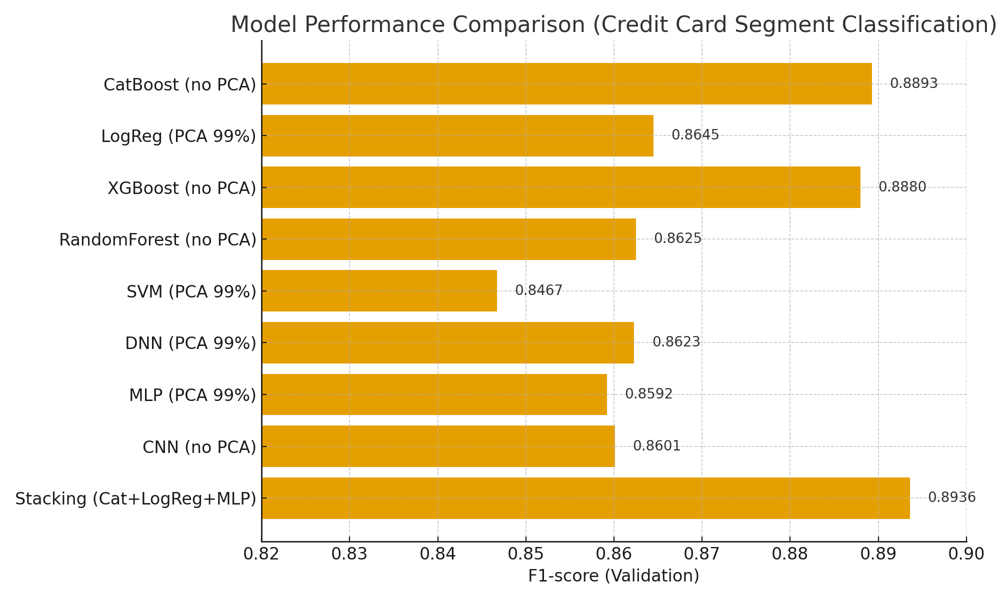

# 💳 Credit Card Customer Segment Classification: Top 25% Solution

## 📌 Project Overview
This repository contains the solution for the **Credit Card Customer Segment Classification AI Competition**. The goal is to classify credit card customers into distinct segments based on their behavioral and transactional data to optimize marketing strategies and improve user experience.

The project handles a massive, high-dimensional dataset with **2.4 million rows** and **857 features**, featuring extreme class imbalance and complex missing data patterns.

---

## 📊 1. Data & Preprocessing (데이터 및 전처리)

- **Scale**: ~2.4M rows, 857 columns.
- **Extreme Class Imbalance**:
  - Class E: 1,922,052 (Majority)
  - Class B: 144 (Extreme Minority)
  - Addressed via strategic oversampling of minority classes and undersampling of majority classes.
- **Big Data Handling**: Leveraged **Dask DataFrame** for efficient processing of data exceeding memory limits.

### 🛠️ Advanced Imputation Strategy (고급 결측치 처리 원리)
Instead of simple mean/mode imputation, a hybrid approach of domain-driven logic and machine learning was used:

1. **Rule-Based Logical Imputation (도메인 논리 기반 대체)**:
   - **Telecom Code (`가입통신회사코드`)**: Filled with 'Not Registered' (`미가입`) if the customer has no active card or zero usage.
   - **Workplace Province (`직장시도명`)**: Filled with the residential province (`거주시도명`) based on the high probability of working in the same area.
   - **1st Priority Credit/Check (`_1순위신용체크구분`)**: Classified into 'Unused', 'Credit', or 'Check' based on interactive usage logic.

2. **Predictive Machine Learning Imputation (머신러닝 기반 예측 대체)**:
   - **Target Variables**: `혜택수혜율_R3M`, `혜택수혜율_B0M` (Benefit Usage Rate - high missing rate but critical features).
   - **Predictor Features**: Used 8 highly correlated variables including usage amounts (`이용금액_R3M_신용/체크`), valid card counts, age, and gender.
   - **Method**: Trained a **Multi-Output RandomForest Regressor** on non-missing data to precisely predict and fill the missing values.

---

## 🤖 2. Modeling & Evaluation (모델링 및 평가)

The project explored both traditional tree-based ensembles and cutting-edge tabular deep learning models.

### Key Experiments & Results

| Model | Preprocessing / Strategy | F1-Score | Status |
| :--- | :--- | :---: | :--- |
| **XGBoost Baseline** | Original Data | 0.607 (Public) | Baseline |
| **XGBoost** | Missing Pattern Features | 0.625 (Public) | Feature Engineering Uplift |
| **CatBoost** | Single Model (20k Sample) | **0.8893 (Val)** | Strongest Single Model |
| **TabNet** | PyTorch-TabNet (20k Sample) | 0.8285 (Test) | SOTA Tabular DL |
| **Stacking Ensemble** | CatBoost + LogReg + MLP | **0.8936 (Val)** | **Best Performance** |

*   **Final Competition Rank**: **58th Place (Top 25%)** with a Private Score of 0.6251.

### 📈 Model Performance Comparison

*Figure: Comparison of Weighted F1-Scores across different models (CatBoost, TabNet, Stacking, etc.)*

### Insights
- **Tree Models > Deep Learning**: For this tabular dataset, gradient boosting models (CatBoost, XGBoost) outperformed complex deep learning architectures like TabNet in both speed and accuracy.
- **Missing Data as a Feature**: Encoding the *presence* of missing values provided a significant lift in model performance, indicating that the missingness itself was informative of customer behavior.

## 🏁 3. Future Work (향후 과제)
- Implement **Stratified K-Fold** cross-validation on the full dataset.
- Optimize hyperparameters using **Optuna**.
- Apply **Cost-sensitive Learning** or Focal Loss to better address the extreme class imbalance.
- Implement **SHAP/XAI** for model interpretability to provide actionable business insights.

---

## 📁 Repository Structure
```text
├── notebooks/                  # Exploratory and experimental notebooks
│   ├── missing_mechanism_analysis.ipynb
│   ├── tabnet_experiments.ipynb
│   └── train_eval_20k.ipynb
├── src/                        # Extracted Python scripts from notebooks
│   ├── baseline_xgb.py
│   ├── missing_mechanism_analysis.py
│   ├── preprocess_missing_features.py
│   ├── preprocess_overview.py
│   ├── scaling_log_standard.py
│   ├── tabnet_experiments.py
│   └── train_eval_20k.py
├── reports/                    # Experiment summaries and reports
│   └── 실험요약.md
└── README.md                   # Project documentation
```

---
*Refactored and polished to meet professional software engineering standards for the [Data Analyst Portfolio](https://github.com/junhyung-L).*
